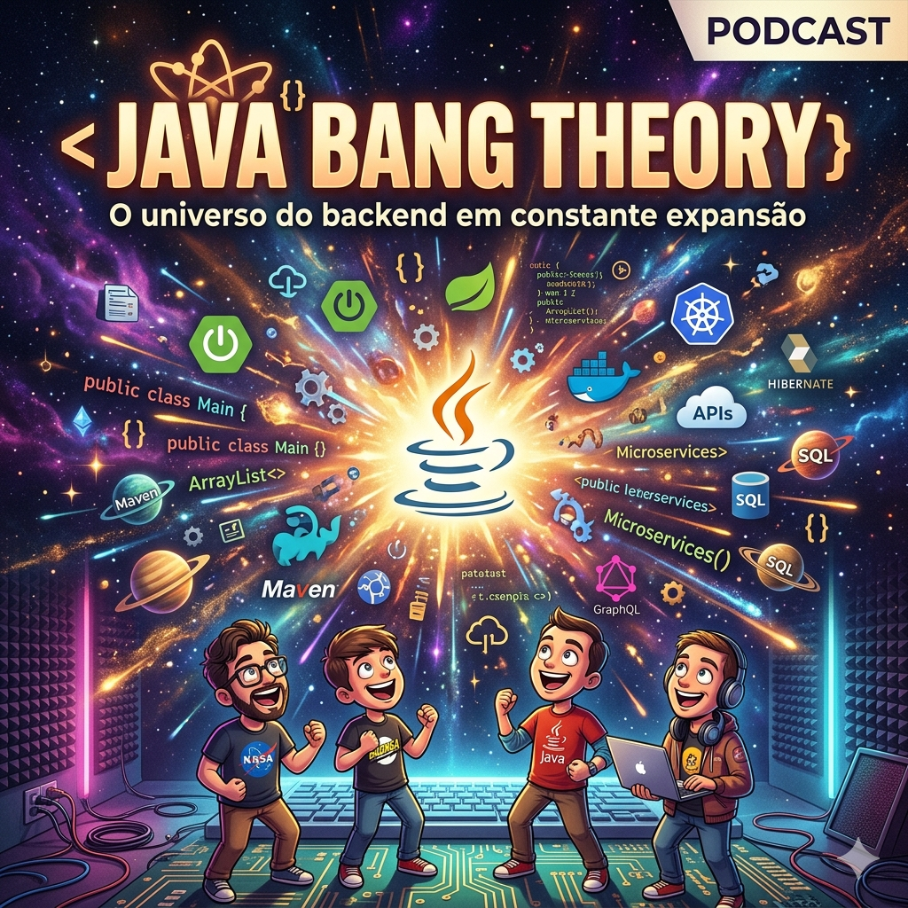

# Projeto Podcast Gerado por I.A.s

Projeto com o objetivo de gerar um podcast utilizando ferramentas de IA através de prompts mais trabalhado.

Utilizado uma esteira de prompts para gerar cada etapa do processo criativo.

[Dê o play no vídeo](output/podcast_video.mp4)
[Dê o play no aúdio](output/podcast.mp3)

## 💻 Tecnologias utilizadas no projeto

- [ChatGPT](https://chat.openai.com/) 
- [ElevenLabs](https://beta.elevenlabs.io/)
- [Gemini](https://gemini.google.com/)
- [Capcut](https://www.capcut.com/pt-br/)

## ✨ Como foi feito ?

- Roteiro gerado via chatgpt
- Audio gerado pela elevenLabs
- Gemini para gerar capa e podcaster
- Capcut para tratar aúdio e adicionar sons de fundo
